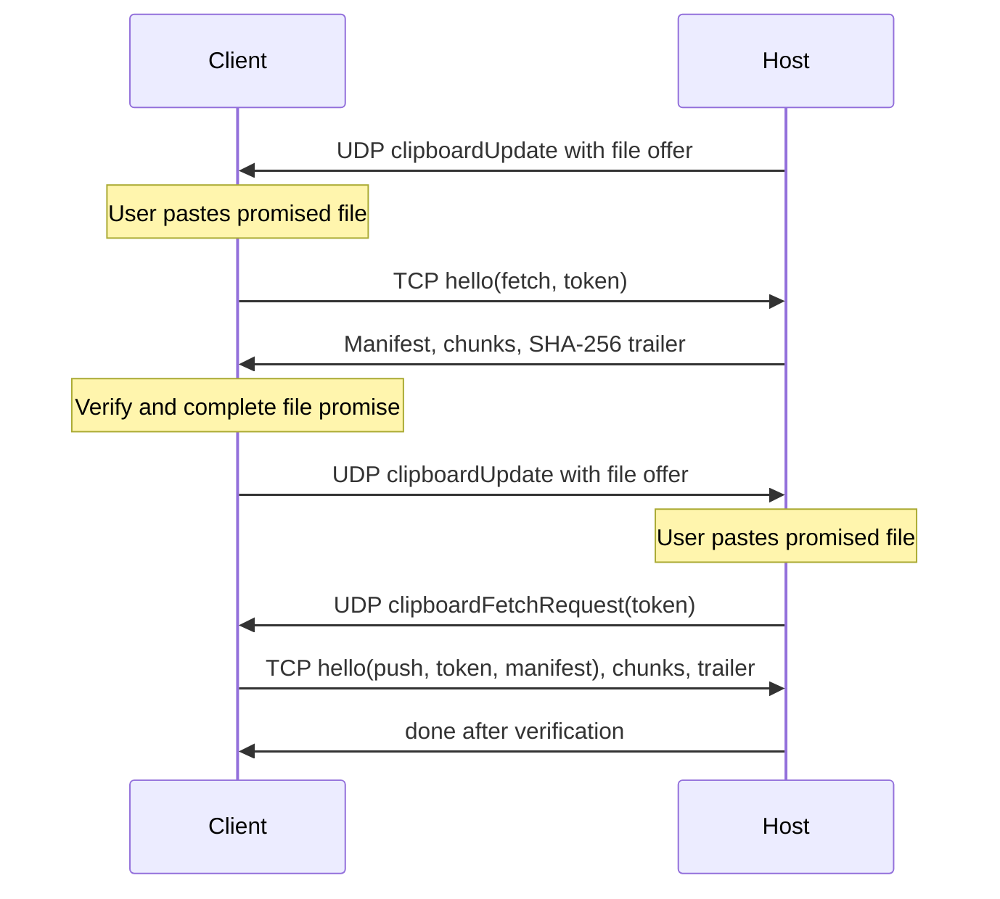

# Clipboard synchronization over LocalCast

LocalCast synchronizes supported clipboard content in both directions while a viewer is connected to a host. Copy in a host app and paste in a local app, or copy locally and paste through the viewer into the host app. Both Macs must run a compatible TidalDrift build and have Clipboard Sync enabled. A loopback session disables synchronization because the two roles share one pasteboard.

## Supported content and boundaries

- Plain text, RTF, HTML, and images synchronize automatically after copying. Text retains its original plain text, RTF, and HTML representations when present. Older peers ignore the optional HTML field and retain their existing text/RTF behavior.
- Regular files synchronize lazily through `NSFilePromiseProvider`. Copying offers file names and sizes. Content transfers when the receiving app requests the promised files on paste. Empty files are supported. A successful paste stages verified bytes and then copies them into the destination supplied by the receiving app.
- Files, large text, and large images require a password-protected, keyed LocalCast session. A passwordless session supports only inline content within the encoded 32 KiB limit. There is no bulk listener on a passwordless session.
- The bulk limit is 100 MiB for the complete transfer and 64 regular files. Directories, application bundles, resource forks, extended attributes, file permissions, and arbitrary application-specific pasteboard types are not transferred. Files are read at paste time, so the original file must remain readable and unchanged in size after being copied.
- Apps must support file promises to receive files. The receiving app chooses the final filename and destination. Existing files are never overwritten by TidalDrift; an unresolved destination collision fails the paste. Numeric collision suffixes inside the staging directory do not guarantee the receiving app's destination naming behavior.

These capabilities do not establish full parity with macOS Screen Sharing. In particular, directory/package transfer, metadata preservation, arbitrary pasteboard representations, and performance against Screen Sharing require further implementation or comparison on two Macs.

## Privacy and settings

The Clipboard Sync toggle is persisted as `clipboardSyncEnabled` in UserDefaults and checked independently on both peers. Copies made before the session begins are not sent. Copies observed while synchronization is disabled are not sent when it is re-enabled. Disabling synchronization invalidates pending offers and promises on the next poll; late eager completions check the setting before applying anything. Existing pasteboard contents are retained when the session stops.

Pasteboards marked `org.nspasteboard.ConcealedType`, `org.nspasteboard.TransientType`, or `org.nspasteboard.AutoGeneratedType` are skipped. These markers are commonly used by password managers. An unsupported or concealed newer copy also invalidates the previous outbound offer. Applications that omit confidentiality markers cannot be recognized as confidential by the clipboard engine.

The removed standalone `_tidalclip._tcp` clipboard service is not used. Clipboard synchronization is scoped to a LocalCast session.

## Detection, ordering, and recovery

`ClipboardSyncEngine` runs on the main actor and polls the pasteboard every 0.5 seconds. It reads files before images and images before text, since Finder also provides filenames as text. The engine records the change count returned by `clearContents()` and uses a content digest for short-lived echo suppression.

Each outbound announcement is sent immediately, then retried after 80 ms and a further 160 ms, spreading the three attempts across separate network bursts. Receivers deduplicate update IDs. This improves resilience to short loss bursts but is not acknowledged delivery. Three lost announcements still require a new copy. The protocol also has no cross-peer total ordering for simultaneous copies.

An eager text/image completion applies only if the engine is still running, synchronization is enabled, the remote update is still current, and the local pasteboard has the same change count as when the fetch began. Thus a slow transfer cannot replace a newer local or remote copy, or write after session teardown. Invalid inline payloads and invalid image headers are rejected before the local pasteboard is cleared.

A newer copy invalidates the prior token, pending retries, transfers, and file promises. File tokens remain valid until superseded, allowing repeated paste. Failed file promise fetches can be retried by pasting again. Completed staging directories are removed when their promise is invalidated; a completion arriving after invalidation is also cleaned up. File content remains in temporary staging after a successful paste until the offer is invalidated or the session ends. No startup sweep of staging directories left by an abrupt process crash is currently implemented.

## Channels and protocol

Inline updates and bulk offers use LocalCast UDP packet type 22 (`clipboardUpdate`). A host asks its client to push a promised offer with type 23 (`clipboardFetchRequest`), carrying its 32-byte token. That fetch request is repeated three times by the session and deduplicated at the client. The encoded JSON inline limit includes base64 expansion.

The client initiates all bulk TCP connections to port 5906. Fetch and push direction are independent of connection direction:

Bulk frames are a four-byte big-endian length followed by sealed bytes. The frame types are hello, hello acknowledgment, chunk, trailer, and done. The chunk body contains a four-byte monotonic sequence followed by at most 256 KiB of content. Empty chunks and oversized frames are rejected. Incoming manifests must match the announced content kind, total size, and each file name and size. File totals are checked without integer overflow.

Each peer has one active bulk connection, shared between its incoming and outgoing transfers. New client transfers cancel the previous connection. The host cancels active transfers on stop or offer invalidation. Per-operation idle timeouts are 30 seconds; host connections also have a 160-second total lifetime limit to prevent a trickling peer from occupying the slot indefinitely. Listener failures retry with bounded backoff. Failure does not end the video session, but the user currently receives no transfer progress or failure UI.

## Authentication, integrity, and limits

Password-protected UDP packets use session AES-GCM encryption. Bulk uses a separate HKDF-SHA256-derived subkey with info `LocalCast-Clipboard-v1`. Keyed receivers reject plaintext frames, including the hello. Tokens authorize the offered content; a host accepts pushes only for a requested token. The session client's address is a soft check on keyed connections, with possession of the key providing authentication across multiple interfaces.

AES-GCM authenticates each sealed frame. Sequence checking enforces chunk order within a transfer, and a SHA-256 trailer verifies the received content before file promises deliver bytes. These checks do **not** provide cryptographic binding of every frame to its transfer token or a complete replay defense: transfers reuse the clipboard session subkey. A versioned protocol with per-transfer key derivation or authenticated transfer IDs and fresh connection nonces is still needed for that guarantee. UDP fragment headers are likewise outside the encrypted packet, so fragment authentication occurs only after reassembly. Bounded buffering limits allocation but cannot prevent an unauthenticated sender from disrupting reassembly.

File names are restricted to a final path component, reject hidden names, NUL, backslashes, and overlong components, and are sanitized before a file promise exposes them to the receiving app. Content streams into temporary files and is delivered only after complete verification. Image metadata is inspected before decoding; images exceeding 64 Mi pixels are rejected. A maximum-sized accepted image can still consume substantial memory when AppKit creates its TIFF representation.

## Compatibility and verification

Peers predating clipboard packet types ignore them. No clipboard capability negotiation or visible unsupported-peer hint is currently available. Optional HTML fields are backward compatible with the previous JSON payload; the legacy text/RTF digest is unchanged when HTML is absent.

The Swift package tests use private named pasteboards, never the user's general pasteboard. Clipboard tests need access to the macOS pasteboard service; restricted test environments may reject all pasteboard reads. Tests cover representation round trips, confidentiality markers, malformed offers, stale completions, disable/re-enable privacy, empty files, frame limits, manifest matching, encryption/tamper rejection, and filename sanitization. The in-app suite also includes a bulk TCP loopback transfer.

Before claiming parity, exercise both directions on two Macs with text/RTF/HTML, screenshots, empty and multiple files, repeated paste, name collisions, denied pasteboard/file access, setting changes during eager transfer, disconnect/re-auth, sleep/wake, and a dropped bulk connection. Confirm that bytes move only on paste for files and that a local copy made during a slow incoming transfer is retained. A reliable-delivery test should deliberately drop all three UDP announcements and record the current limitation.
