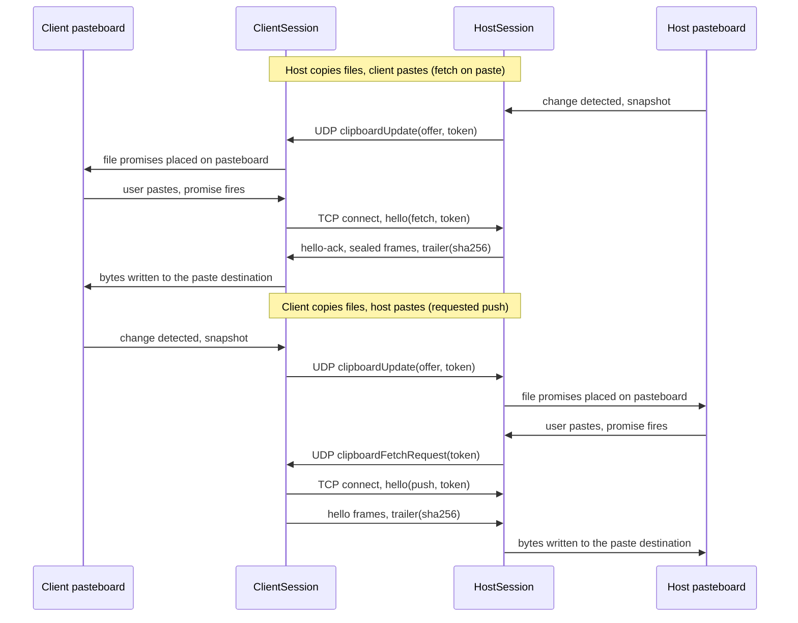

# Clipboard Sync over LocalCast

Design for bidirectional clipboard and file synchronization between two Macs during an active LocalCast session. This document also covers the removal of the legacy standalone clipboard service.

## Problem

TidalDrift ships a standalone clipboard service (`ClipboardSyncService`, Bonjour type `_tidalclip._tcp`, TCP 51234) with two defects that disqualify it:

1. **It broadcasts plaintext.** Every clipboard change is JSON-encoded and sent, unencrypted and unauthenticated, to every machine on the LAN advertising the service type. Anything the user copies, including credentials from a password manager, is readable by any LAN listener.
2. **It cannot paste.** Received items are appended to an in-memory history that no live UI displays; they are never written to the system pasteboard. The feature appears functional in the README but does not work.

Meanwhile, LocalCast sessions already provide mutual pairing (HKDF-SHA256 over a shared password plus nonces) and AES-256-GCM encryption on every post-auth packet. Clipboard traffic belongs inside that boundary.

## Decisions

| Question | Decision |
|---|---|
| Trigger | Automatic sync while a LocalCast session is active. No sync outside a session. |
| Scope | Plain text, rich text (RTF), images, and full file contents. Cmd-C in Finder on one Mac, Cmd-V in Finder on the other, produces the file. |
| Legacy service | Removed entirely, with its orphaned history views and the `_tidalclip._tcp` Bonjour registration. |
| Direction | Bidirectional: host to client and client to host. |

## Architecture

Two channels, chosen by payload size and kind:

- **Inline channel.** Small payloads (encoded packet payload at or below 32 KiB, which covers most text and RTF) travel as a new `clipboardUpdate` packet on the existing LocalCast UDP session. They inherit session encryption and authentication with no new security surface. Reliability follows the input-event precedent: each update is sent three times and deduplicated by `updateId` on the receiving side. The limit applies to the encoded JSON payload, so base64 inflation of binary fields is already accounted for.
- **Bulk channel.** Files and large payloads (images, long text) travel over a dedicated TCP connection on port 5906 (`LocalCastConfiguration.clipboardPort`; 5905 is taken by the UDP speed test). TCP provides ordering and retransmission, which the UDP transport intentionally does not offer for non-video traffic; a multi-megabyte transfer over the fragmented UDP path would fail on any single lost fragment.

The client always initiates the TCP connection, because the client already knows the host address and the host may not be able to connect back through the client's firewall. Transfer direction is independent of connection direction.

**Images and large text transfer eagerly** (they exist only in pasteboard memory on the receiver). **Files transfer lazily**: copying files sends only an offer, and the receiver puts `NSFilePromiseProvider`s on its pasteboard. Bytes move when the user actually pastes, and they land in the paste destination. Eager file materialization was rejected in review: it would write every copied file to the peer's disk, persisting even if never pasted, turning an idle Cmd-C into silent data transfer. Lazy transfer also means an unsolicited push cannot occur; a push is accepted only against a token the receiver itself presented in a fetch request.



### New packet types

`PacketType.clipboardUpdate = 22` announces a clipboard change (inline content or a bulk offer). `PacketType.clipboardFetchRequest = 23` is sent by the host when its user pastes promised files, asking the client to connect and push the offered content; it carries the offer token as its payload. Both are post-auth control packets, sent three times with receiver-side dedup (by `updateId` and token respectively). `clipboardUpdate` JSON payload:

```swift
struct ClipboardUpdatePayload: Codable {
    let updateId: UUID          // dedup across the triple-send
    let kind: Kind              // text | image | files
    let text: String?           // inline text
    let rtf: Data?              // inline rich text, written alongside text
    let png: Data?              // inline image (small screenshots)
    let bulk: BulkOffer?        // set when content exceeds the inline limit
    let digest: Data            // SHA-256 of canonical content, echo suppression
}

struct BulkOffer: Codable {
    let token: Data             // 32 random bytes, valid until superseded
    let totalBytes: Int64
    let files: [FileStub]?      // nil for large text/image bulk
}
```

A `clipboardUpdate` with `bulk == nil` is applied directly. With `bulk` set, the receiver resolves it over TCP: eagerly for images and large text, on paste for files. Tokens are not time-limited; each side holds one outbound offer at a time, and a newer copy or session teardown invalidates the previous token. A time limit was rejected in review because a failed fetch after expiry would permanently lose the update with no re-offer path, and file promises can legitimately be pasted minutes later. Image and text tokens are consumed by one successful transfer; file tokens stay valid until superseded, since a promise can be pasted more than once.

### Bulk channel protocol

Framing: `[UInt32 big-endian length][frame]`, where each frame is `SessionCrypto.encrypt(plaintext, clipboardKey)` when the session is keyed, or the plaintext wrapper when the session runs without a password. Content is chunked at 256 KiB plaintext per frame, and each sealed chunk's plaintext begins with a 4-byte per-transfer sequence number, validated monotonic, so frames from one transfer cannot be spliced into another under the same session key. The stream ends with a JSON trailer carrying the SHA-256 of the transferred content; a mismatch discards the transfer.

- **Key derivation.** `clipboardKey = HKDF-SHA256(sessionKey, info: "LocalCast-Clipboard-v1")`. A distinct subkey keeps bulk traffic cryptographically separated from the UDP session without inventing a second handshake.
- **Downgrade rejection.** On a keyed session the receiver rejects any plaintext-flagged frame and drops the connection, mirroring the rule `UDPTransport` already enforces for packets. The hello itself is sealed on keyed sessions, so possession of the derived key is proven on the first frame. An active-client IP check without this rule would be meaningless against an on-path attacker.
- **Passwordless sessions** carry no session key; the entire session, including video and input injection, is already plaintext by the user's choice, so clipboard text and images match that level rather than exceeding it. **File sync requires a keyed session.** On a keyless session the offer token travels in cleartext and the active-client identity is trivially takeable (any LAN host can become the active client by sending one packet), which is tolerable for pasteboard text but not for writing files to disk. Tokens are compared in constant time.
- **Host listener lifecycle.** The listener binds only while a session is running with an authenticated, non-loopback client, and accepts connections only from the active client's address (a soft check on keyed sessions, where the sealed hello is the real gate). Bind failure retries with backoff and degrades the session to inline-only sync, logged; a listener that fails later (sleep/wake) is rebound while the session remains active.
- **Limits.** 100 MiB per transfer, 64 files per transfer, 30 s idle timeout, single active transfer per direction. Incoming frame lengths are capped at the chunk size plus sealing overhead; an oversized length aborts the connection. File names are sanitized to their last path component with `..`, separators, and leading dots rejected. Directories are skipped in v1.
- **Collision policy.** Received file bytes stream to a temporary file and move into place atomically only after the trailer digest verifies. Existing files are never overwritten; names dedup with a numeric suffix ("report 2.pdf"). Aborted transfers leave nothing behind.

### Clipboard engine

One engine class serves both roles, owned by `HostSession` and `ClientSession`:

- **Detection.** Polls `NSPasteboard.general.changeCount` every 0.5 s while the session is active (the interval the legacy service already used; cost is negligible next to 60 fps video).
- **Privacy.** A pasteboard carrying `org.nspasteboard.ConcealedType`, `org.nspasteboard.TransientType`, or `org.nspasteboard.AutoGeneratedType` is never synced. Password managers mark copies with these types precisely so utilities will ignore them.
- **Snapshot priority.** File URLs, then image, then text. Finder places both file URLs and a name string on the pasteboard; files must win. Text snapshots carry RTF alongside the plain string when present.
- **Echo suppression.** The primary gate is `changeCount`: applying a remote update records the count returned by `clearContents()` (not a read-back afterward, which races a concurrent user copy) and the poll skips an unchanged count. The digest is the second layer for apps that rewrite the pasteboard: it is defined canonically per kind (text: UTF-8 plus RTF bytes; image: the exact PNG bytes, which apply writes first and capture reads first; files: sorted name:size pairs, machine-independent so receiver-side renames do not diverge). The outbound digest gate is time-boxed to two seconds after an apply, since its only job is the prompt app-rewrite echo; an unbounded gate would swallow a deliberate later re-copy of the same content. For the same reason a local copy clears the receive-side duplicate gate, and there is deliberately no last-sent digest check: review found it suppresses a legitimate re-copy of earlier content after the remote side has changed the pasteboard in between. A duplicate send of identical content is harmless; a swallowed copy is not.
- **Apply.** Text writes string and RTF representations; images write the received PNG bytes plus a TIFF rendition for older apps; file offers place `NSFilePromiseProvider`s so bytes land in the paste destination on demand. Promised files never touch disk unless pasted.
- **Races.** A newer local copy cancels any pending outbound transfer and supersedes the outstanding token. Completion order decides ties; last writer wins. An oversized copy is skipped with a log; the changeCount gate prevents retrying it every poll tick.
- **Loopback sessions** (viewer and host on one machine) disable the engine entirely; both roles would be watching one pasteboard.

### Settings

A single toggle, default on, stored in `UserDefaults` under the existing key `clipboardSyncEnabled` so current users keep their preference. It is deliberately not added to the `AppSettings` Codable struct: that struct is decoded with a plain `JSONDecoder` whose failure path resets all settings, so a new non-optional field would wipe user configuration on first launch after upgrade. Both sides check the toggle independently; a disabled receiver ignores updates and refuses bulk connections.

## Removal of the legacy service

Deleted: `Services/ClipboardSyncService.swift`, `Views/Dashboard/ClipboardSyncTabView.swift`, `Views/Experimental/ClipboardSyncView.swift`, and the `_tidalclip._tcp` entry in `Info.plist`. The build scripts `build-app.sh` and `build-release.sh` generate their own `Info.plist` with a baked-in `NSBonjourServices` array; both lose the `_tidalclip._tcp` entry too, or release builds would keep advertising the dead service. Rewired to the new toggle: `MenuBarView`, `SettingsView` (General), `StatusCardView`. `TroubleshootingView` copy updated. `BulletPoint` stays; `AppStreamingTabView` uses it. The `clipboardSyncEnabled` UserDefaults key is reused, not migrated.

## Compatibility

An older peer that receives packet type 22 or 23 drops it silently: `LocalCastPacket.deserialize` returns nil for an unknown type byte, so the packet never reaches a handler (a debug build logs a parse failure; release builds log nothing). The feature degrades to a no-op rather than failing the session, but there is no visible hint on the sender that the peer is too old. No capability negotiation ships in v1. The `.config` packet type (raw value 6, currently unused) remains available if negotiation becomes necessary.

## Port map

| Port | Protocol | Use |
|---|---|---|
| 5900 | TCP | VNC / Screen Sharing |
| 5901 | TCP | StreamingNetworkService |
| 5902 | TCP | TidalDrop file transfer |
| 5904 | UDP | LocalCast session |
| 5905 | UDP | Speed test (`SpeedTestService`) |
| 5906 | TCP | LocalCast clipboard bulk channel (new) |

## Testing

- **SPM unit tests.** Payload snapshot and apply round-trips against a private named `NSPasteboard` (never `NSPasteboard.general`, which would clobber the developer's clipboard); echo-suppression digest logic; bulk frame codec round-trip including tamper rejection; file name sanitization; the packet round-trip test gains the new type.
- **In-app test suite.** A loopback bulk transfer over 127.0.0.1 with a derived key, following the existing TidalDrop loopback test pattern, registered in `TidalDriftTestRunner`.
- **Manual acceptance.** Between two Macs: text both directions; RTF retains formatting; screenshot image paste; single file and multi-file Finder copy both directions, verifying bytes move only on paste and land in the paste destination; name collision produces "name 2.ext" rather than an overwrite; password manager copy does not sync; toggle off stops sync both ways; keyless session syncs text and images but not files; old build peer degrades gracefully.

## Non-goals for v1

Clipboard sync outside an active LocalCast session, clipboard history UI, HTML fidelity beyond RTF, directory transfers, transfer progress UI, file sync on passwordless sessions, apps that cannot read file promises (Finder, Mail, and most document apps can), and hardening of the legacy standalone service (it is removed instead).
